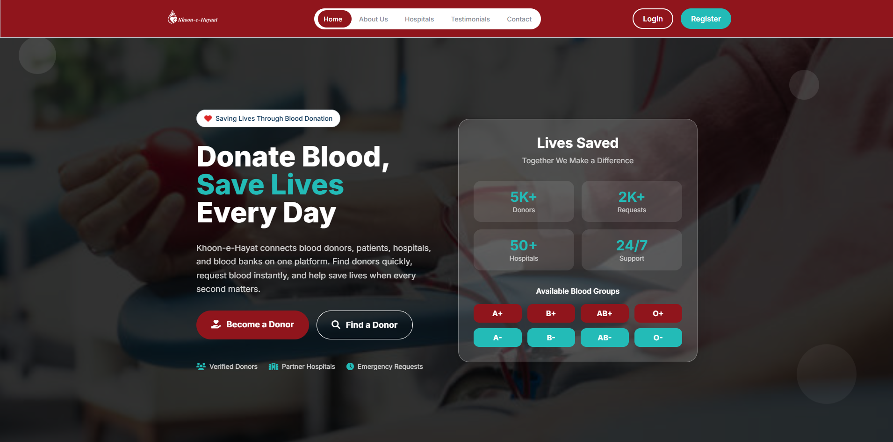
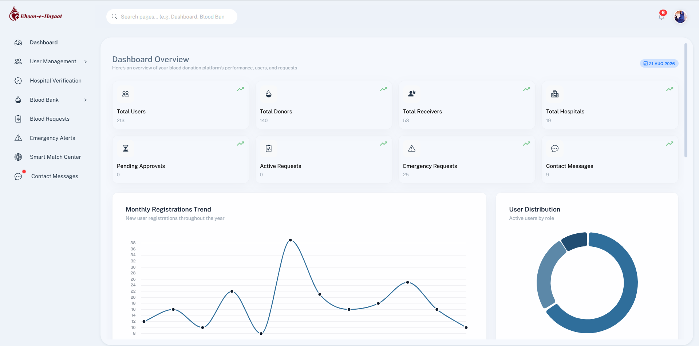
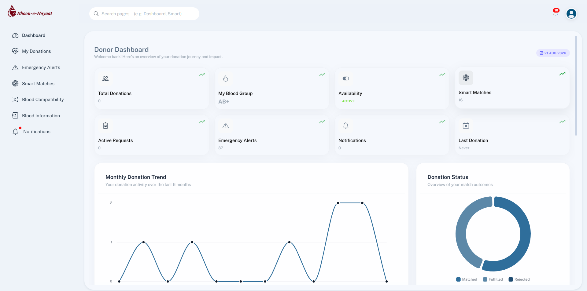
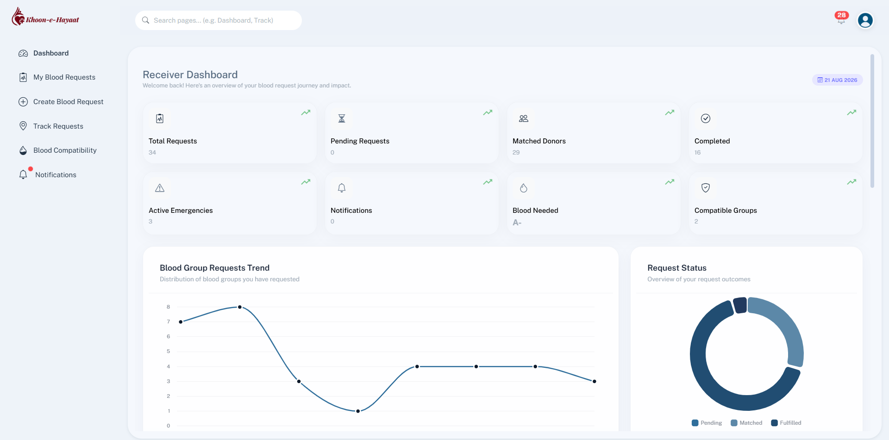
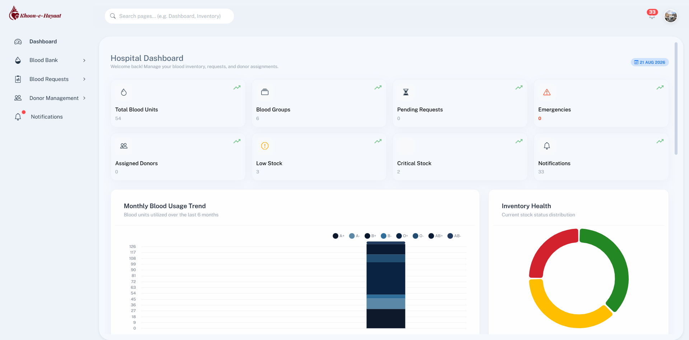
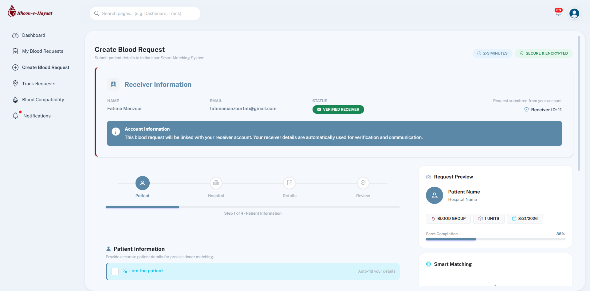
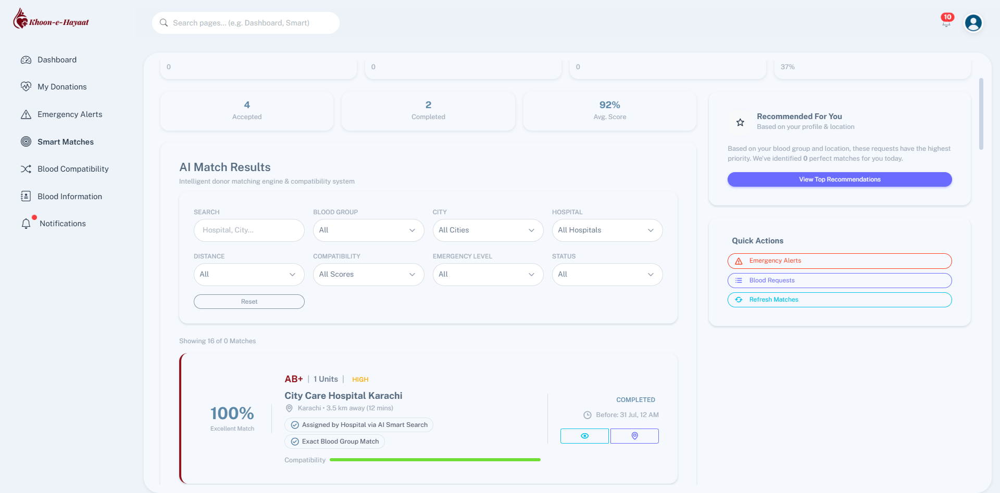

# 🩸 LifeBridge – Blood Donation Management System

**LifeBridge** is a full-stack **Blood Donation Management System** designed to digitally connect **Donors, Receivers, Hospitals, and Administrators** through a centralized platform.

The system helps streamline **blood request management, donor matching, hospital workflows, blood inventory management, donation tracking, notifications, and role-based operations**.

LifeBridge was developed as a web-based application using **ASP.NET MVC, C#, Entity Framework, Microsoft SQL Server, HTML5, CSS3, JavaScript, Bootstrap, Tailwind CSS, SignalR, and third-party integrations**.

---

## 📌 Project Overview

Finding compatible blood donors during emergency situations can be difficult when donor information, hospital blood inventory, and blood requests are managed through disconnected sources.

**LifeBridge** provides a centralized platform where different users can manage the complete blood donation workflow digitally.

### The system allows:

* 🩸 Receivers to submit blood requests.
* 🏥 Hospitals to review and manage blood requests.
* 🏦 Hospitals to manage blood inventory.
* 🧠 Hospitals to search for compatible donors.
* 👨‍🦱 Hospitals to assign suitable donors.
* ✅ Donors to accept or reject assigned requests.
* 👨‍💼 Administrators to manage the overall platform.
* 🔔 Users to receive notifications and important updates.

### 🎯 Main Goal

The primary goal of LifeBridge is to make blood donation management **more organized, efficient, accessible, and technology-driven**, especially when quick coordination is required.

---

# ✨ Key Features

## 🔐 Authentication & Authorization

LifeBridge provides role-based authentication and authorization for different types of users.

### Features:

* User registration
* User login
* Role-based authentication
* Admin authentication
* Donor authentication
* Receiver authentication
* Hospital authentication
* Password reset functionality
* Secure password hashing using **BCrypt**
* Session-based authentication
* Role-based access to dashboards and features

---

# 👨‍💼 Admin Panel

The **Admin Panel** provides centralized control over the LifeBridge platform.

### Admin capabilities:

* 👥 User management
* 🩸 Donor management
* 👤 Receiver management
* 🏥 Hospital management
* 📋 Blood request management
* ✅ Hospital approval management
* 📢 Announcements
* 🔔 Notifications
* 📊 Dashboard statistics
* 📈 System activity monitoring
* 🧠 Smart matching overview

The administrator acts as the central management layer of the platform and helps maintain system-wide operations.

---

# 🩸 Donor Panel

The **Donor Panel** allows registered donors to manage their profiles, assigned blood requests, and donation-related activities.

### Donor features:

* Donor dashboard
* Donor profile management
* Blood group information
* Donation history
* Assigned blood requests
* SmartMatch requests
* Blood compatibility information
* Accept donor assignment
* Reject donor assignment
* Donation tracking
* Notifications

### Donor Workflow

```text
Hospital
   ↓
Search Compatible Donors
   ↓
Select Donor
   ↓
Assign Donor
   ↓
Donor Receives Notification
   ↓
Accept / Reject
   ↓
Donation Process
```

---

# 🏥 Hospital Panel

The **Hospital Panel** is responsible for managing blood requests, inventory, donor searches, and donation-related workflows.

### Hospital features:

### 📊 Hospital Dashboard

* Hospital statistics
* Blood inventory overview
* Incoming request overview
* Emergency request overview
* Donor activity overview

### 🏦 Blood Bank Management

* Blood inventory
* Blood collection history
* Blood issue history
* Low-stock monitoring
* Expiring blood monitoring

### 📋 Blood Request Management

* Incoming blood requests
* Emergency blood requests
* Request tracking
* Request approval
* Request status management

### 🧠 Donor Management

* Smart Donor Search
* Compatible donor search
* Donor assignment
* Assigned donor management
* Donor responses

### 🔔 Notifications

Hospitals can receive notifications regarding:

* New blood requests
* Emergency requests
* Donor responses
* Request updates
* System announcements

---

# 👤 Receiver Panel

The **Receiver Panel** allows users to submit and track their blood requirements.

### Receiver features:

* Receiver dashboard
* Receiver profile
* Blood request creation
* Multi-step blood request wizard
* Blood group selection
* Units required
* Hospital selection
* Blood compatibility preview
* Blood availability checking
* Compatible donor estimation
* Request tracking
* Emergency request support
* Notifications

---

# 📝 Blood Request Workflow

LifeBridge follows a structured blood request workflow.

```text
Receiver
   ↓
Create Blood Request
   ↓
Request Saved
   ↓
Hospital Receives Request
   ↓
Hospital Reviews Request
   ↓
Check Blood Inventory
   ↓
Inventory Sufficient?
   ├── YES → Issue Blood From Inventory
   │
   └── NO
        ↓
   Smart Donor Search
        ↓
   Find Compatible Donors
        ↓
   Select Suitable Donor
        ↓
   Assign Donor
        ↓
   Donor Notification
        ↓
   Accept / Reject
        ↓
   Donation Workflow
```

---

# 🧠 Smart Donor Matching

LifeBridge includes a **Smart Donor Matching workflow** to help hospitals identify suitable donors when available blood inventory is insufficient.

### Smart Matching Workflow

1. Receiver creates a blood request.
2. Hospital receives the request.
3. Hospital checks available blood inventory.
4. The system determines whether sufficient blood is available.
5. If sufficient blood is available, the hospital can issue blood from inventory.
6. If inventory is insufficient, the hospital can open **Smart Donor Search**.
7. Compatible donors are identified based on blood compatibility and available donor information.
8. Hospital reviews suitable donors.
9. Hospital selects and assigns a donor.
10. Assigned donor receives the request.
11. Donor can accept or reject the assignment.
12. The donation workflow can proceed after donor acceptance.

### Simplified Logic

```text
Blood Request
      ↓
Check Hospital Inventory
      ↓
 ┌───────────────┐
 │ Enough Blood? │
 └───────┬───────┘
         │
    ┌────┴────┐
   YES        NO
    ↓          ↓
Issue From   Smart Donor
Inventory      Search
                ↓
        Compatible Donors
                ↓
          Select Donor
                ↓
          Assign Donor
                ↓
        Donor Response
```

This approach prevents unnecessary donor searches when the required blood is already available in hospital inventory.

---

# 🏦 Blood Inventory Management

Hospitals can maintain their blood stock through a centralized inventory management system.

### Inventory features:

* Blood group-wise inventory
* Blood quantity tracking
* Blood collection records
* Blood issue records
* Low-stock monitoring
* Expiring blood monitoring
* Blood availability checking
* Inventory-based request validation

### Inventory Workflow

```text
Blood Collection
      ↓
Blood Inventory
      ↓
Track Quantity
      ↓
 ┌───────────────┐
 │ Blood Needed? │
 └───────┬───────┘
         ↓
     Issue Blood
         ↓
 Update Inventory
```

---

# 🩸 Blood Compatibility

LifeBridge provides blood compatibility information to support blood request processing and donor matching.

Compatibility information is integrated into:

* Blood request creation
* Blood compatibility preview
* Smart donor search
* Donor matching workflow
* Blood requirement analysis

This helps hospitals identify appropriate donor blood groups during the matching process.

---

# 🚨 Emergency Blood Requests

LifeBridge supports **Emergency Blood Requests** for urgent blood requirements.

Emergency requests can be identified and prioritized during the hospital workflow.

### Emergency workflow:

```text
Receiver
   ↓
Emergency Blood Request
   ↓
Hospital Notification
   ↓
Inventory Check
   ↓
Smart Donor Search if Required
   ↓
Donor Assignment
   ↓
Donor Response
```

This workflow is designed to reduce delays when immediate blood coordination is required.

---

# 🔔 Notification System

LifeBridge includes a notification system to keep users informed about important activities.

### Notifications can be used for:

* 🩸 Blood request updates
* 🏥 Hospital approval
* 👨‍🦱 Donor assignments
* ✅ Donor responses
* 📢 Admin announcements
* 🔄 System updates

The application also includes **SignalR Hubs** for real-time communication and notification infrastructure where applicable.

---

# 📧 Email Notifications

LifeBridge supports email-based communication through **Gmail SMTP**.

Email functionality can be used for important system events such as:

* Blood request updates
* Hospital approval notifications
* Donor assignment notifications
* Account-related communication
* Password reset communication
* Important system updates

---

# 🗺️ Location & Communication Integrations

LifeBridge also includes external integrations to support location-based and communication-related functionality.

### Integrations:

* **Google Maps API** – Location and distance-related functionality
* **WhatsApp API** – WhatsApp communication and notification functionality
* **Gmail SMTP** – Email communication and notifications

---

# 🛠️ Technologies Used

## 🎨 Frontend

| Technology         | Purpose                                            |
| ------------------ | -------------------------------------------------- |
| **HTML5**          | Page structure and semantic markup                 |
| **CSS3**           | Styling and responsive layouts                     |
| **JavaScript ES6** | Client-side functionality and dynamic interactions |
| **Bootstrap**      | Responsive UI components and layouts               |
| **Tailwind CSS**   | Utility-based styling for selected interfaces      |

---

## ⚙️ Backend

| Technology           | Purpose                                                 |
| -------------------- | ------------------------------------------------------- |
| **C#**               | Core backend programming language                       |
| **ASP.NET MVC**      | Web application architecture and backend framework      |
| **Entity Framework** | ORM and database interaction                            |
| **BCrypt**           | Secure password hashing                                 |
| **SignalR**          | Real-time communication and notification infrastructure |

---

## 🗄️ Database

| Technology               | Purpose                 |
| ------------------------ | ----------------------- |
| **Microsoft SQL Server** | Relational database     |
| **Entity Framework**     | Database access and ORM |

---

## 🔌 APIs & Integrations

| Integration         | Purpose                                     |
| ------------------- | ------------------------------------------- |
| **Gmail SMTP**      | Email notifications                         |
| **Google Maps API** | Location and distance-related functionality |
| **WhatsApp API**    | Communication and notifications             |

---

## 🧰 Development Tools

* **Visual Studio**
* **Git**
* **GitHub**
* **SQL Server Management Studio**
* **GitHub Repository**

---

# 🏗️ System Architecture

LifeBridge follows the **ASP.NET MVC architecture** with Entity Framework for database interaction.

```text
                    ┌──────────────────────┐
                    │        User          │
                    └──────────┬───────────┘
                               ↓
                    ┌──────────────────────┐
                    │      View / UI       │
                    │ HTML / CSS / JS      │
                    │ Bootstrap / Tailwind │
                    └──────────┬───────────┘
                               ↓
                    ┌──────────────────────┐
                    │     Controller       │
                    │    ASP.NET MVC       │
                    └──────────┬───────────┘
                               ↓
                    ┌──────────────────────┐
                    │ Service / Business   │
                    │      Logic           │
                    └──────────┬───────────┘
                               ↓
                    ┌──────────────────────┐
                    │   Entity Framework   │
                    │        ORM           │
                    └──────────┬───────────┘
                               ↓
                    ┌──────────────────────┐
                    │    SQL Server DB     │
                    └──────────────────────┘
```

---

# 👥 User Roles

LifeBridge supports four major user roles.

| Role            | Main Responsibilities                                                      |
| --------------- | -------------------------------------------------------------------------- |
| 👨‍💼 **Admin** | Manage users, hospitals, donors, receivers, requests and system activities |
| 🩸 **Donor**    | Manage profile, view assigned requests and respond to donor assignments    |
| 👤 **Receiver** | Submit blood requests and track request status                             |
| 🏥 **Hospital** | Manage requests, inventory, donors and blood-related workflows             |

---

# 🔄 Overall System Workflow

```text
                         LifeBridge
                             │
             ┌───────────────┼───────────────┐
             ↓               ↓               ↓
         Receiver          Hospital         Admin
             │               │               │
             ↓               ↓               ↓
      Create Request     Review Request   Manage System
             │               │
             └───────→ Inventory Check
                             │
                    ┌────────┴────────┐
                    ↓                 ↓
                 Sufficient        Insufficient
                    │                 │
                    ↓                 ↓
              Issue Blood       Smart Donor Search
                                      │
                                      ↓
                              Compatible Donors
                                      │
                                      ↓
                                Assign Donor
                                      │
                                      ↓
                               Donor Notification
                                      │
                               ┌──────┴──────┐
                               ↓             ↓
                            Accept         Reject
                               │
                               ↓
                         Donation Workflow
```

---

# 📂 Main System Modules

LifeBridge is organized around the following major modules:

```text
LifeBridge
│
├── Authentication
│   ├── Registration
│   ├── Login
│   ├── Password Reset
│   └── Role Management
│
├── Admin
│   ├── User Management
│   ├── Donor Management
│   ├── Receiver Management
│   ├── Hospital Management
│   ├── Blood Requests
│   ├── Announcements
│   └── Notifications
│
├── Donor
│   ├── Dashboard
│   ├── Profile
│   ├── SmartMatch
│   ├── Assigned Requests
│   ├── Donation History
│   └── Notifications
│
├── Receiver
│   ├── Dashboard
│   ├── Create Blood Request
│   ├── Blood Compatibility
│   ├── Request Tracking
│   └── Notifications
│
└── Hospital
    ├── Dashboard
    ├── Blood Inventory
    ├── Blood Collection
    ├── Blood Issue
    ├── Blood Requests
    ├── Smart Donor Search
    ├── Donor Assignment
    ├── Donor Responses
    └── Notifications
```

---

# 🔒 Security

LifeBridge implements several security-related mechanisms, including:

* Role-based authorization
* Session-based authentication
* BCrypt password hashing
* Protected role-specific dashboards
* Server-side validation
* Entity Framework database access
* Authentication and authorization checks

---

# 📸 Project Preview

The following screenshots showcase the main interfaces and workflows of LifeBridge.

## 🏠 Landing Page



---

## 👨‍💼 Admin Dashboard



---

## 🩸 Donor Dashboard



---

## 👤 Receiver Dashboard



---

## 🏥 Hospital Dashboard



---

## 🚨 Blood Request Management



---

## 🧠 Smart Donor Search



---

# 🚀 Project Highlights

### LifeBridge demonstrates practical implementation of:

* Full-stack web application development
* ASP.NET MVC architecture
* C# backend development
* Entity Framework ORM
* SQL Server database management
* Role-based authentication and authorization
* CRUD operations
* Multi-role dashboard development
* Blood inventory management
* Blood compatibility logic
* Smart donor matching workflow
* Request management
* Notification systems
* Real-time communication infrastructure
* API integrations
* Responsive web design
* Git and GitHub version control

---

# 🧪 Development Focus

The project focuses on solving a real-world problem through software engineering by combining:

```text
User Management
       +
Blood Requests
       +
Hospital Inventory
       +
Blood Compatibility
       +
Smart Donor Matching
       +
Notifications
       +
Role-Based Workflows
       ↓
   LifeBridge
```

---

# 🩸 Built with Purpose

LifeBridge was designed and developed by **Fatima Manzoor** with the goal of using technology to make blood donation management more organized, accessible, and efficient.

## 👩‍💻 Meet the Developer

### Fatima Manzoor

**Software Engineering Student | Full-Stack Web Developer**

Passionate about building modern, responsive, and meaningful web applications using technologies such as **ASP.NET MVC, C#, SQL Server, JavaScript, Bootstrap, React.js, and modern web technologies**.

### 🔗 Connect With Me

* **GitHub:** [fatimamanzoor94](https://github.com/fatimamanzoor94)
* **LinkedIn:** [Fatima Manzoor](https://linkedin.com/in/fatimamanzoorfati)

---

# 📌 Project Status

🚧 **LifeBridge is an actively developed academic/full-stack project.**

The system contains multiple role-based modules and workflows including authentication, blood requests, hospital management, donor matching, inventory management, notifications, and donation tracking.

---

# 📄 License

This project was developed for **educational and portfolio purposes**.

---

# ⭐ Support

If you find this project useful or interesting, consider giving the repository a ⭐ on GitHub.

---

## 🩸 LifeBridge

**Connecting Blood Donors, Receivers, Hospitals, and Technology — Because Every Drop Matters.**
